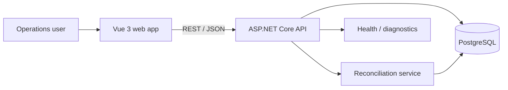

# LedgerFlow

A financial operations dashboard for reviewing transactions, reconciling exceptions, and maintaining an append-only audit trail. I built this project to demonstrate the kind of full-stack work that shows up in internal banking and operations platforms: dense data tables, deterministic business rules, API design, state management, observability, and deployment automation.

## What it does

- Presents transaction volume, settlement totals, exception counts, and reconciliation rate in one dashboard.
- Supports search by transaction reference/account and filtering by reconciliation status.
- Runs server-side reconciliation rules and records the decision behind every match or exception.
- Writes audit events for reconciliation actions so operational changes remain traceable.
- Exposes health endpoints and structured error responses for supportability.
- Includes containerized local infrastructure and a CI workflow for web, API, and tests.

## Stack

| Layer | Technology |
| --- | --- |
| Frontend | Vue 3, TypeScript, Pinia, Vue Router, Vite |
| API | ASP.NET Core 8 Web API, C# |
| Persistence | PostgreSQL, Entity Framework Core |
| API contract | REST, OpenAPI / Swagger |
| Testing | xUnit business-rule tests; CI type/build checks |
| Delivery | Docker Compose, GitHub Actions |

## Architecture



The frontend keeps UI-only concerns in Vue components and cross-page state in Pinia stores. The API uses controllers for transport concerns, services for business rules, and EF Core for persistence. Reconciliation rules are deliberately deterministic so they can be tested without a database.

## Repository layout

```text
apps/web/                  Vue + TypeScript client
services/api/              ASP.NET Core Web API
services/api.tests/        xUnit tests for business rules
docs/                      Architecture notes
.github/workflows/         CI pipeline
```

## Run locally

### 1. Start PostgreSQL

```bash
docker compose up -d db
```

### 2. Start the API

```bash
cd services/api
dotnet restore
dotnet run
```

The API creates the demo schema/data on startup and will be available at `http://localhost:5080`. Swagger is available at `/swagger` in Development.

### 3. Start the web app

```bash
cd apps/web
npm install
npm run dev
```

Open `http://localhost:5173`.

## API examples

```http
GET /api/transactions?status=Exception&query=INV-1042
POST /api/transactions/{id}/reconcile
GET /health
```

## Engineering decisions

- **ProblemDetails instead of ad-hoc errors.** Clients receive consistent HTTP error payloads.
- **Audit records are append-only.** The application never updates an existing audit event.
- **Business rules live outside controllers.** This keeps reconciliation logic testable and avoids controller-heavy code.
- **Server-side filtering and paging.** Large transaction datasets should not be fully loaded into the browser.

## Next improvements

- OIDC authentication and role-based authorization for operations vs. approvers.
- Idempotency keys for reconciliation commands.
- OpenTelemetry traces exported to an observability backend.
- Background settlement import using a queue.

## Author

**Rahul Kumar Maurya**  
Full Stack Developer · Toronto, ON  
GitHub: [rahulk030](https://github.com/rahulk030)
